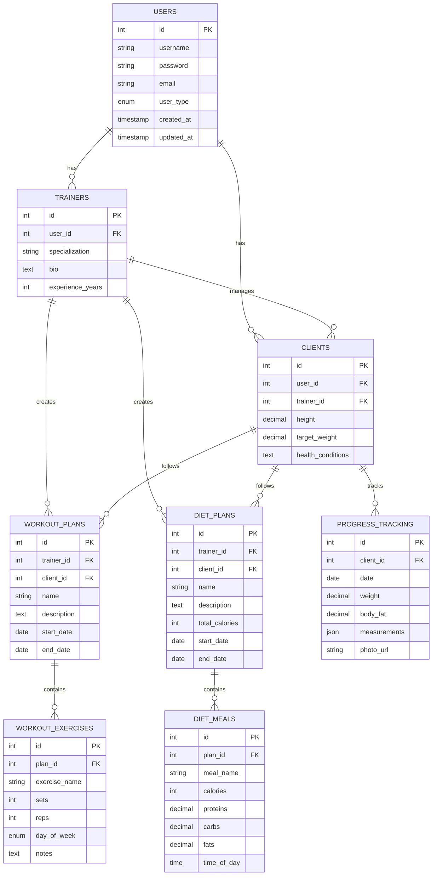

# Gym Management System - ER Diagram

## Relationship Details

1. Users can be either Trainers or Clients (1:1)
2. Trainers can manage multiple Clients (1:N)
3. Trainers can create multiple Workout Plans and Diet Plans (1:N)
4. Clients can have multiple Workout Plans and Diet Plans (1:N)
5. Workout Plans contain multiple Exercises (1:N)
6. Diet Plans contain multiple Meals (1:N)
7. Clients can have multiple Progress Tracking entries (1:N)

## Key Features
- Role-based user system (Trainers and Clients)
- Comprehensive workout and diet planning
- Detailed progress tracking with measurements and photos
- Flexible meal and exercise scheduling
- Complete client management for trainers
